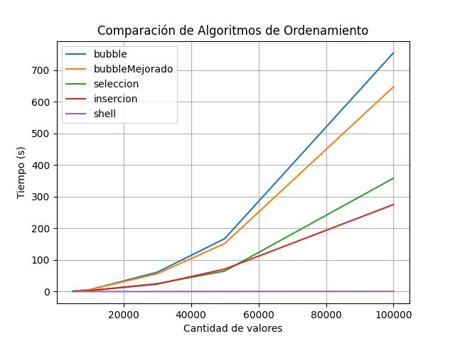

# Práctica de Algoritmos de Ordenamiento

## 📌 Información General

- **Título:** Práctica de Teorema de la Complejidad
- **Asignatura:** Estructura de Datos
- **Carrera:** Computación
- **Estudiantes:** Daniel Antonio Durán, Adriano Rodas
- **Fecha:** 10/05/2025
- **Profesor:** Ing. Pablo Torres

---

## 🛠️ Descripción

Este proyecto implementa y compara varios algoritmos de ordenamiento en Python:

- **Método Burbuja (Bubble Sort)**
- **Método Burbuja Mejorado**
- **Método de Selección (Selection Sort)**
- **Método de Inserción (Insertion Sort)**
- **Método Shell (Shell Sort)**

**Funcionamiento:**

- Se generan arreglos de números aleatorios de distintos tamaños.
- Cada algoritmo ordena una copia del arreglo.
- Se mide el tiempo de ejecución de cada algoritmo.
- Se grafican los resultados.

---

## 🚀 Ejecución

Para ejecutar el proyecto:

1. Instalar las dependencias necesarias:
    ```bash
    pip install matplotlib
    ```

2. Ejecutar el programa principal:
    ```bash
    python app.py
    ```

---
## 🧑‍💻 Ejemplo de Salida

  ```bash
Tamano: 5000, Algoritmo: bubble, Tiempo: 1.444 segundos
Tamano: 5000, Algoritmo: bubbleMejorado, Tiempo: 1.3552 segundos
Tamano: 5000, Algoritmo: seleccion, Tiempo: 0.6866 segundos
Tamano: 5000, Algoritmo: insercion, Tiempo: 0.6522 segundos
Tamano: 5000, Algoritmo: shell, Tiempo: 0.0128 
segundos
Tamano: 100000, Algoritmo: shell, Tiempo: 0.5875 segundos
  ```


## 📈Tabla de resultados 

| Tamaño del Arreglo | Bubble Sort (s) | Bubble Mejorado (s) | Selection Sort (s) | Insertion Sort (s) | Shell Sort (s) |
| ------------------ | --------------- | ------------------- | ------------------ | ------------------ | -------------- |
| 5000               | 1.4440          | 1.3552              | 0.6866             | 0.6522             | 0.0128         |
| 10000              | 5.9193          | 6.0299              | 2.9242             | 2.8512             | 0.0382         |
| 30000              | 61.1676         | 56.2585             | 25.1182            | 23.6905            | 0.1279         |
| 50000              | 167.5910        | 152.1902            | 64.7546            | 71.1576            | 0.2619         |
| 100000             | 755.1944        | 647.8333            | 358.6033           | 275.3913           | 0.5875         |

## 📈 Conclusiones
Bubble Sort y Bubble Mejorado muestran tiempos de ejecución que crecen cuadráticamente (O(n²)), siendo ineficientes para grandes cantidades de datos.

Selection Sort e Insertion Sort también presentan crecimiento cuadrático, pero son un poco más rápidos que el Bubble Sort tradicional.

Shell Sort es mucho más eficiente, mostrando un crecimiento subcuadrático (aproximadamente entre O(n¹·³) y O(n¹·⁵)), siendo el algoritmo más rápido y eficiente de los evaluados.
## 📉 Resultados graficos 



